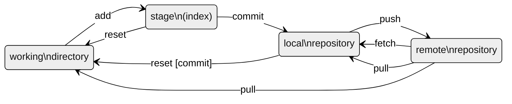
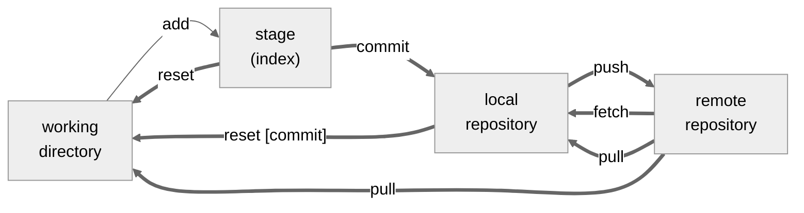

# External Markdown

## `<insert date here>`

-----

## Mermaid Tryout

Note:

---

## Mermaid Tryout2

-----

## 3rd page

look down for nothing special

Note: just a short note

---

## Up You Go

Math Example:

`$$ J(\theta_0,\theta_1) = \sum_{i=0}^{10} a_i $$`

-----

## Image Examples

### Link

### Local

