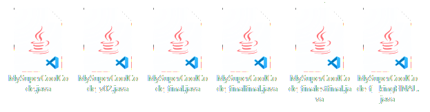
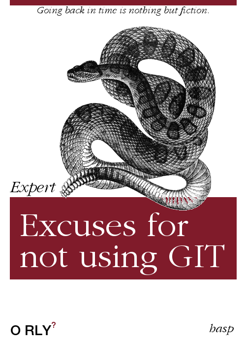

# Git Basics

> *To prevent any kind of confusion:*
>
> - **GIT** is
>   - a **software tool** (command line)
>   - a **Distributed Version Control System**
> - **GITHUB** is
>   - a host for storing projects (repositories)
>     - projects are 'version controlled' by git
>   - a collaboration workspace for coders

---

## What is Git?

- a popular *(distributed) Version Control System* (VCS)
- command line tool
- Free and open source
- created 2005 by Linus Torvalds
- used for
  - coding and writing collaboration
  - tracking changes:
    - **what** (code, text, files)
    - **who**
    - **when**

---

## What is a Version Control System? <small>Part 1</small>

> "Version control lets you track your files over time."

Everyone of us is doing this ("`Save as..`"):

A good way? Hmm...  Even worse: consider a shared folder!

---

## What is a Version Control System? <small>Part 2</small>

- backup and restore
- synchronization
- undo (short and long-term)
- track changes
- track ownership
- sandboxing
  - local tryout
  - branching and merging

---

- Works for small and huge projects
- Supports local repositories and servers
- Want to learn all the details? [Free, online book...](https://git-scm.com/book)
- We will use [*GitHub*](https://github.com)

---

## How to Use Git?

- [Download and install Git...](https://git-scm.com)
- Git command line
  - [Read chapter 2 *Git Basics* of Git book...](https://git-scm.com/book/en/v2/Git-Basics-Getting-a-Git-Repository)
- Visual Git tools; examples:
  - [Git Extensions](https://gitextensions.github.io/)
  - [GitHub Desktop](https://desktop.github.com/)
  - [Sourcetree](https://www.atlassian.com/software/sourcetree)
  - [Git support in VSCode](https://code.visualstudio.com/docs/editor/versioncontrol#_git-support)
- Other tools
  - [gitignore.io](https://www.gitignore.io/)

---

## What You Have to Know

- [Initialize a local Git repository](https://git-scm.com/book/en/v2/Git-Basics-Getting-a-Git-Repository)
- [Tracking changes](https://git-scm.com/book/en/v2/Git-Basics-Recording-Changes-to-the-Repository)
- [Working with remotes](https://git-scm.com/book/en/v2/Git-Basics-Working-with-Remotes)
- [Setup and configure GitHub account](https://git-scm.com/book/en/v2/GitHub-Account-Setup-and-Configuration)

---

## What You Have to Know - Git CLI

| Command                                             | Description                                                  |
| --------------------------------------------------- | ------------------------------------------------------------ |
| [*git init*](https://git-scm.com/docs/git-init)     | Create an empty Git repository or reinitialize an existing one |
| [*git clone*](https://git-scm.com/docs/git-clone)   | Clone a repository into a new directory                      |
| [*git pull*](https://git-scm.com/docs/git-pull)     | Fetch from and integrate with another repository or a local branch |
| [*git add*](https://git-scm.com/docs/git-add)       | Add file contents to the index                               |
| [*git commit*](https://git-scm.com/docs/git-commit) | Record changes to the repository                             |
| [*git log*](https://git-scm.com/docs/git-log)       | Show commit logs                                             |
| [*git push*](https://git-scm.com/docs/git-push)     | Update remote refs along with associated objects             |
| [*git status*](https://git-scm.com/docs/git-status) | Show the working tree status                                 |
| [*git config*](https://git-scm.com/docs/git-config) | Get and set repository or global options                     |

---

## What You *Should* Know

- [Basics about branching](https://git-scm.com/book/en/v2/Git-Branching-Branches-in-a-Nutshell)
  - [Online learning tool for branching](https://learngitbranching.js.org/)
- [GitHub flow](https://guides.github.com/introduction/flow/)

---

## What You Should Know - Git CLI

| Command                                                 | Description                                         |
| ------------------------------------------------------- | --------------------------------------------------- |
| [*git branch*](https://git-scm.com/docs/git-branch)     | List, create, or delete branches                    |
| [*git checkout*](https://git-scm.com/docs/git-checkout) | Switch branches or restore working tree files       |
| [*git merge*](https://git-scm.com/docs/git-merge)       | Join two or more development histories together     |
| [*git stash*](https://git-scm.com/docs/git-stash)       | Stash the changes in a dirty working directory away |
| [*git remote*](https://git-scm.com/docs/git-remote)     | Manage set of tracked repositories                  |
| [*git reset*](https://git-scm.com/docs/git-reset)       | Reset current HEAD to the specified state           |

---

## Additional Information

The following links are some of my favorites:

1. [How to teach Git](https://rachelcarmena.github.io/2018/12/12/how-to-teach-git.html) - we will have a look at that one!
2. and its successor: [Learn git concepts not commands](https://dev.to/unseenwizzard/learn-git-concepts-not-commands-4gjc).
3. [How to explain git in simple words](https://smusamashah.github.io/blog/2017/10/14/explain-git-in-simple-words) - absolutely misleading title, this one goes into depth (hashes, blobs, commits,...)
4. [Understanding the GitHub flow](https://guides.github.com/introduction/flow/) - already mentioned before.
5. [Aha! Moments when learning Git](https://betterexplained.com/articles/aha-moments-when-learning-git/) - we will have a look at that one too!

---

## Book recommendations

It is recommended **NOT** to read the following two books:

  
  

Instead use the online resources mentioned before!

-----

# Markdown

The default documentation on github is written with markdown.

I have to confess - I love it!

Fundamentals: [Markdown](https://daringfireball.net/projects/markdown/)

Note: mainly taken from R. Stropek [Github for Edu - Markdown](https://rstropek.github.io/GitHubEduWorkshop/#/5)

---

## What is Markdown?

- Plain text format
- Easy to write by humans
- Easy to read even with a simple text editor (*readability*)
- Optionally convert to other formats (e.g. HTML, PDF, see [Pandoc](http://pandoc.org/))
- Inline HTML (including SVG) is possible in many cases
- Heavily used by GitHub for e.g. issues, comments, *readme*-files, etc.

---

## GitHub Flavored Markdown

- Exension of Markdown
- [Specification](https://github.github.com/gfm/)
- [Basic writing and formatting syntax](https://help.github.com/articles/basic-writing-and-formatting-syntax/)
- Special features:
  - Relative links
  - Task lists
  - Mentioning people and teams (`@someone` syntax)
  - [Referencing issues and pull requests](https://help.github.com/articles/autolinked-references-and-urls) (`#id` syntax)
  - [Code blocks](https://help.github.com/articles/creating-and-highlighting-code-blocks) including syntax highlighting
