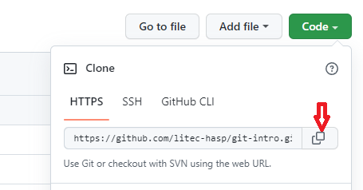

# GIT - Basic Commands

Getting started with Git commands

Note:
mainly taken from <https://github.com/rstropek/git-fundamentals>

---

## Creating a Git repository

- Two options:
  - Start from scratch: [`git init`](https://git-scm.com/docs/git-init)
  - Clone existing repository: [`git clone <repository>`](https://git-scm.com/docs/git-clone)
- Hidden folder *.git*
  - Contains Git database
  - ***Don't delete or manipulate!***

---

## Tips for New Repositories <small>Part1</small>

Get repository name from GitHub



---

## Tips for New Repositories <small>Part2</small>

- Add a [*.gitignore*](https://git-scm.com/docs/gitignore) file
  - Add all files to ignore
  - Generate by using [https://gitignore.io/](https://gitignore.io/)
- Add a *readme.md* file
  - Describe the content of the repository using [Markdown](https://en.wikipedia.org/wiki/Markdown)
- Add a *LICENSE.md* file
  - Especially important for public repositories
  - [https://choosealicense.com/](https://choosealicense.com/) might be helpful
- Specify folder name when cloning
  - Default: Repository name = folder name
  - Optional: Specify alternate folder name after repository<br>(`git clone <repository> <folder>`)

---

## Git Command Overview

| Git Command                                         | Description                                                             |
| --------------------------------------------------- | ----------------------------------------------------------------------- |
| [`status`](https://git-scm.com/docs/git-status)     | Displays paths/files that have differences (created, modified, deleted) |
| [`add`](https://git-scm.com/docs/git-add)           | Adds changes (creations, modifications, deletions) to staging area      |
| [`commit`](https://git-scm.com/docs/git-commit)     | Records changes from staging area to the repository                     |
| [`log`](https://git-scm.com/docs/git-log)           | Shows list of commits                                                   |
| [`diff`](https://git-scm.com/docs/git-diff)         | View changes                                                            |
| [`checkout`](https://git-scm.com/docs/git-checkout) | Restore files from a commit                                             |
| [`show`](https://git-scm.com/docs/git-show)         | Show content of a commit                                                |
| [`revert`](https://git-scm.com/docs/git-revert)     | Reverts changes of a commit                                             |
| [`tag`](https://git-scm.com/docs/git-tag)           | Maintains tags for commits                                              |
| [`stash`](https://git-scm.com/docs/git-stash)       | Stash changes away                                                      |

---

## `git` [`status`](https://git-scm.com/docs/git-status)

```bash
# Show paths/files with differences (created, modified, deleted)
git status

# Compact overview
git status --short
```

- Consider using a GUI tool to explore status of repository
  - E.g. *Source Control* section in vscode

---

## Git [`add`](https://git-scm.com/docs/git-add) and [`commit`](https://git-scm.com/docs/git-commit) Workflow

JREBEL.png)

<small>[Image Source](https://www.jrebel.com/blog/git-cheat-sheet)</small>

---

## `git` [`add`](https://git-scm.com/docs/git-add)

```bash
# Add a single change (creation, modification):
git add index.html

# Add all changes in current folder and subfolders:
git add .

# Add a file that would otherwise be ignored (by .gitignore):
git add --force style.css

# Add all changes including deletions: 
git add --all .

```

- Alternative commands for deletions or renames:
  - `git` [`rm`](https://git-scm.com/docs/git-rm) (remove)
  - `git` [`mv`](https://git-scm.com/docs/git-mv) (move)

---

## `git` [`commit`](https://git-scm.com/docs/git-commit)

```bash
# Commit with message:
git commit -m 'fix: added missing styles'

# Commit all changes without having to separately call add and/or rm:
git commit -a -m '...'

# Amend (=replace) last commit:
git commit --amend -m '...'
```

- Good writing practices for commit messages:
  - see [ConventialCommits](https://www.conventionalcommits.org/en/v1.0.0/)
  - don't do it as shown below!<br>
    

<small>[Image Source](https://imgs.xkcd.com/comics/git_commit.png)</small>

---

## *HEAD*

- Typically references to the *current* or *active* branch
- Can be *detached* (i.e. referencing a specific commit, not a branch)
- Referencing relative to *HEAD*
  - `HEAD~` means the first parent of the tip of the current branch<br> (or commit in case of detached *HEAD*)
  - You can go back multiple steps (e.g. `HEAD~~` or `HEAD~2`)

---

## `git` [`revert`](https://git-scm.com/docs/git-revert)

- Revert changes that a commit introduced<br> and record reverting in a new commit
- Tip: Use `-n` switch to just do the edits without commit
- Revert changes of the fourth last commit:<br> `git revert HEAD~3`
- Revert changes from fifth to to the third last (included) commit:<br>
  `git revert main~4..main~2`

## `git` [`reset`](https://git-scm.com/docs/git-reset)

- Can be used to undo local changes
- Undo local edits: `git reset --hard`

---

## Exercises, Further Readings

- Exercises (rstropek)
  - add/commit: [Lab: Building a Website in a Local Repository](https://github.com/rstropek/git-fundamentals/blob/master/content/labs/0020-local-repo.md)
  - tag/stash: [Lab: Building a Simple Game in a Local Repository](https://github.com/rstropek/git-fundamentals/blob/master/content/labs/0030-tags-stashing.md)
- Further readings:
  - [*Git Basics* in Git book](https://git-scm.com/book/en/v2/Git-Basics-Getting-a-Git-Repository)

---

## End of Git-Commands

*Please, do not read:*


