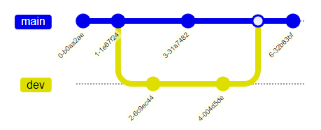

# Git - Collaboration

Teamwork in Git

---

## Remotes

- Versions <!-- .element: class="fragment" --> of your project hosted on the Internet or network somewhere
  - Here: GitHub
- 0..n <!-- .element: class="fragment" --> remotes
  - Some read-only, some read-write
- Collaborate <!-- .element: class="fragment" --> by pulling and pushing data to and from them
- Credentials <!-- .element: class="fragment" -->
  - Store credentials with [credential helpers](https://git-scm.com/docs/gitcredentials)
  - Check configured credential helper: `git config --global credential.helper`
  - Example: [GitHub on Windows](https://help.github.com/en/github/using-git/caching-your-github-password-in-git)
  - Example: [WSL 2](https://docs.microsoft.com/en-us/windows/wsl/tutorials/wsl-git#git-credential-manager-setup)

---

## Overview

| Git Command                                         | Description                                        |
| --------------------------------------------------- | -------------------------------------------------- |
| [`remote`](https://git-scm.com/docs/git-remote)     | Maintain remotes                                   |
| [`clone`](https://git-scm.com/docs/git-clone)       | Clone a repository into a new directory            |
| [`fetch`](https://git-scm.com/docs/git-fetch)       | Fetch branches and/or tags from other repositories |
| [`pull`](https://git-scm.com/docs/git-pull)         | Fetch from and integrate with another repository   |
| [`push`](https://git-scm.com/docs/git-push)         | Update remote branches and/or tags                 |
| [`checkout`](https://git-scm.com/docs/git-checkout) | Restore working tree files                         |

---

## `git remote` ([ref](https://git-scm.com/docs/git-remote))

- List <!-- .element: class="fragment" --> remotes: `git remote -v`
- Add <!-- .element: class="fragment" --> remote: `git remote add <name> <url>`
- Remove <!-- .element: class="fragment" --> remote: `git remote remove <name>`
- Get <!-- .element: class="fragment" --> URL of remote: `git remote get-url <name>`

---

## `git fetch` ([ref](https://git-scm.com/docs/git-fetch)), `git pull` ([ref](https://git-scm.com/docs/git-pull))

- Fetch <!-- .element: class="fragment" --> gets latest meta-data from remote repository
  - Does not do any file transfer
- Fetches <!-- .element: class="fragment" --> latest meta-data and integrates change in local repository

---

## Exercises, Further Readings

- Exercises
  - [Lab: Building a Website with GitHub](https://github.com/rstropek/git-fundamentals/blob/master/content/labs/0040-remotes.md)
- Further readings:
  - [*Working with Remotes* in Git book](https://git-scm.com/book/en/v2/Git-Basics-Working-with-Remotes)

---

## Branching

- Diverge <!-- .element: class="fragment" --> from the main line of development and continue to do work without messing with that main line
- Git <!-- .element: class="fragment" --> branches are lightweight
  - Branching operations are nearly instantaneous
  - Switching back and forth is generally fast
- Branch <!-- .element: class="fragment" --> early, branch often

---

## Overview

| Git Command                                         | Description                                |
| --------------------------------------------------- | ------------------------------------------ |
| [`checkout`](https://git-scm.com/docs/git-checkout) | Switch branches                            |
| [`branch`](https://git-scm.com/docs/git-branch)     | List, create, or delete branches           |
| [`merge`](https://git-scm.com/docs/git-merge)       | Join development histories together        |
| [`rebase`](https://git-scm.com/docs/git-rebase)     | Reapply commits on top of another base tip |

---

## Branching

- Simple workflow:
  - Create a branch for each feature
  - Create a branch for each bug fix
  - Let the *main* branch be clean by not making it a *Work In Progress* (WIP)

---

## Branching - GitFlow


Atlassian.png)

[Source](https://www.atlassian.com/git/tutorials/comparing-workflows/gitflow-workflow)

---

## Merging

[Learn Git Branching](https://learngitbranching.js.org/)

```mermaid-gitGraph
       commit
       commit
       branch dev
       checkout dev
       commit
       checkout main
       commit
       checkout dev
       commit
       checkout main
       merge dev
       commit
```



-  **Advantage**: It’s a *non-destructive* operation (existing branches are not changed).

---

## Rebase

- Another way to "move" your branch back to `main` (or any other branch) is `rebase`:
  - Taking one branch and 
  - adding it to the tip of another, 
  - where the tip is simply the last commit in the branch.

- **Advantage**: Cleaner project history
- **Disadvantage**:  
  - Rewriting project history (traceabilty problem)
  - Safety problems (more merge conflicts, destructive operation)

#### Workflow

```mermaid-gitGraph_rebase_not_working_atm
branch bugfix
commit
rebase main
commit
rebase main
checkout main
merge bugfix
```

---

## Merge Conflicts

- If Git isn't able to merge cleanly -> conflict
  - Merge process is paused
  - Use `git status` to see unmerged files
  - Git adds standard conflict-resolution markers
  - Tip: Use merge tool or IDE to resolve

```text
<<<<<<< HEAD:readme.md
Merge conflicts are best to be solved in the command line.
=======
Solving merge conflicts on the CLI is pretty hard
if you are not confident with `vi` or `vim`. 
Better use an editor like `vscode`. Try it out right now!
>>>>>>> iss23:readme.md
```

---

## Exercises, Further Readings

- Exercises (rstropek)
  - [Demo: *Merge Conflict Resolution*](https://github.com/rstropek/git-fundamentals/blob/master/content/labs/9010-merge-conflict.md)
  - [Lab: *Building a Simple Game with Branching*](https://github.com/rstropek/git-fundamentals/blob/master/content/labs/0050-branching.md)
- Further readings:
  - [*Basic Branching and Merging* in Git book](https://git-scm.com/book/en/v2/Git-Branching-Basic-Branching-and-Merging)