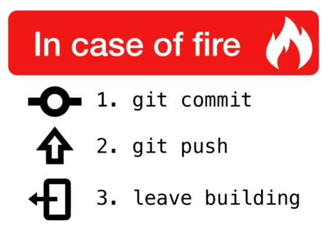

# Markdown

Learning [Markdown](https://daringfireball.net/projects/markdown/)...

Note:
based on <https://github.com/rstropek/GitHubEduWorkshop/>

---

## What is Markdown?

- Plain text format
- Easy to write by humans
- Easy to read even with a simple text editor (*readability*)
- Optionally convert to other formats (e.g. HTML, PDF)
- Inline HTML (including SVG) is possible in many cases
- Heavily used by GitHub for e.g. issues, comments, *readme*-files, etc.

---

## GitHub Flavored Markdown

- Extension of Markdown
- [Specification](https://github.github.com/gfm/)
- [Basic writing and formatting syntax](https://help.github.com/articles/basic-writing-and-formatting-syntax/)
- Special features:
  - Relative links
  - Task lists
  - Mentioning people and teams (`@someone` syntax)
  - [Referencing issues and pull requests](https://help.github.com/articles/autolinked-references-and-urls) (`#id` syntax)
  - [Code blocks](https://help.github.com/articles/creating-and-highlighting-code-blocks) including syntax highlighting
- [Mastering Markdown](https://guides.github.com/features/mastering-markdown/) Guide

---

## Markdown in GitHub

- [README files](https://docs.github.com/en/github/creating-cloning-and-archiving-repositories/about-readmes)
- Documentation in [Wikis](https://docs.github.com/en/github/building-a-strong-community/about-wikis)
- [Issues](https://docs.github.com/en/github/managing-your-work-on-github/about-issues)
  - Note [task lists](https://docs.github.com/en/github/managing-your-work-on-github/about-task-lists)
- [Pull request comments](https://docs.github.com/en/github/collaborating-with-issues-and-pull-requests/commenting-on-a-pull-request)
- Generally usable in every text area
- **NEW FEATURE**: embed diagrams with [mermaid](https://mermaidjs.github.io/)

---

## Markdown Beyond GitHub

- Convert Markdown into PDF using e.g. [Pandoc](http://pandoc.org/)
  - [Read more](http://www.software-architects.com/devblog/2017/05/23/Markdown-pandoc-conceptual-documents)
  - Also available on [Docker Hub](https://hub.docker.com/r/jagregory/pandoc/)
- Build presentations with [Reveal.js](https://revealjs.com/)
- Use [*markdownlint*](https://github.com/markdownlint/markdownlint) to verify correctness
  - [*markdownlint* VSCode extension](https://marketplace.visualstudio.com/items?itemName=DavidAnson.vscode-markdownlint) available
- Tip: [Visual Studio Code](https://code.visualstudio.com) has many [Markdown plugins](https://marketplace.visualstudio.com/search?term=markdown&target=VSCode&category=All%20categories&sortBy=Relevance)
- Tip: Use a [spell checker in VSCode](https://marketplace.visualstudio.com/search?term=spell%20checker&target=VSCode&category=All%20categories&sortBy=Relevance) to prevent typos in documentation and source code
- Try *markdownlint* and *spell checker* with [GitHub Flow lab](https://github.com/rstropek/GitHubEduWorkshop/tree/master/hands-on-labs/github-flow)

---

## THAT'S IT

Always remember:

