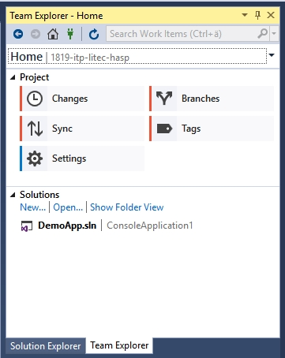
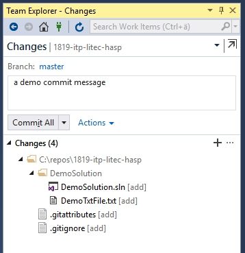
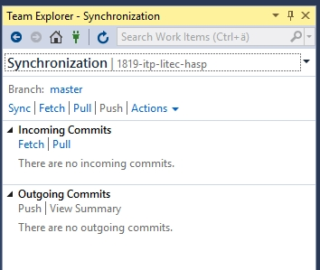

# Git and Visual Studio

### Usage of git within Visual Studio.

3 Steps (add some smaller ones to that list) to success.

---

## Step 1 - Clone your Git Repository

1. Log in to <https://github.com>, open up your repository and click on `Clone or download` .
1. Select the **FULL** link (or click on the clipboard art right of it).
1. Open up a bash or command line in your repository folder - for example `C:\_repos\` .
1. Type `git clone <your_repo_link>`  and wait for the download to finish

---

## Step 2 - Creating a VS Project within Your Git Repository

1. Open up Visual Studio 2019 (or 2022)
1. Create a new Solution and set the location of the solution **WITHIN** the repository folder.
1. And here we go! You have set up version control within Visual Studio!

> Alternative to Step 1 and 2: directly open remote repository within Visual Studio:
> `Menu -> File -> Clone or Checkout Code`
> Works well if you already have a VS solution within the remote repository!

---

## Step 3 - Working with Git within VS

1. The Team Explorer tab is to be found right beside the Solution Explorer tab.
    - If it is not visible use `Menu -> View -> Team Explorer`
    - or use shortcuts: `Ctrl+^` or `Ctrl+M`
1. Open up the Team Explorer and you get a view similar to this:

---

### 3a. Team Explorer View

The most important fields (one needs alll the time):

1. The home-icon in the upper part is to return to the view above.
1. One important area is the `Changes`-Button - used to add (stage) and commit your changes.
1. The second important area is the `Sync`-Button to push or pull your changes.

---

### 3b. `Changes`-Area

1. Choose which files to add (lower area)
1. Add your commit message to the according field and then 
1. either choose `Commit All` (if you want to store just locally) ,
1. or `Commit All and Push` (if you want your changes also to be sent to remote repository)

---

### 3c. The `Sync`-Area

1. Download changes from remote repository (github) to your local workspace: `Pull`
1. Just get information about changes on the remote repository (github): `Fetch`
1. Send local changes (local commits) to remote repository (github): `Push`
